# EquiKenotte
---------------------------------------
Application de gestion à destination des dentistes équin.

Elle permet la gestion de :
* Fichier clients
* Fichier fournisseurs
* Agenda et prises de rendez-vous
* Facturation
* Fiches de soins et comptes-rendus
* Statistiques

## Problématique
-----------------------------------
Parallelement à la pratique de la dentisterie équine, le pacticien fait face à de nombreuses taches administratives souvent gérées de façon dissociées.
* Un agenda papier permet la gestion du planning
* Un facturier papier permet la redaction de facture manuellement
* Des fiches de soins prè-imprimées permettent la rédaction des comptes-rendus clients
* La nécessité d'une statistique quelquonque promet quelques heures de recherche de données et de calculs manuels

Cette gestion dissociée de tout ces postes administratifs facilite les erreurs et prends beaucoup de temps.

> Une amie dentiste équin m'a indiqué qu'aucune solution informatique viable dédiée à son activité n'existait et m'a donc soumie l'idée de proposer une solution à cette problématique.

## Fonctionnalités
----
Pour la réalisation de la première version de l'application, un MVP (Minimum Viable Product) a été défini. Il comprendra les fonctionnalités suivantes :
* Le gestion du fichier clients
* La facturation
* L'édition de fiche de soins didactique pour le client
* Tableau de bord permettant une vision globale de l'activité

## Cas d'utilisations
------------
**Qu'est ce qu'un cas d'utilisation ou *use case* :**

Un cas d'utilisation permet de mettre en évidence les relations fonctionnelles entre les acteurs et le système réalisé. 
Les diagramme de cas d'utilisation permet de représenter visuellement une séquence d'actions réalisées par un système produisant un resultat sur un acteur et ceci indépendamment de son fonctionnement interne.

**Exemples de cas d'utilisations :**
* S'inscrire
* Réaliser un devis
* Etablir une facture

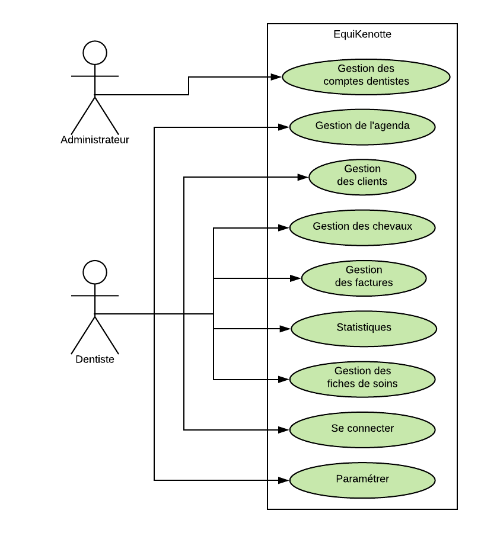

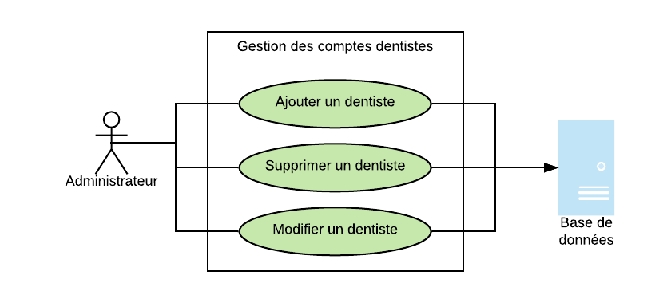

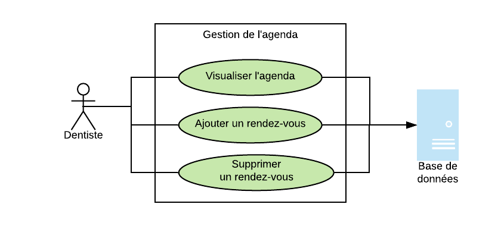

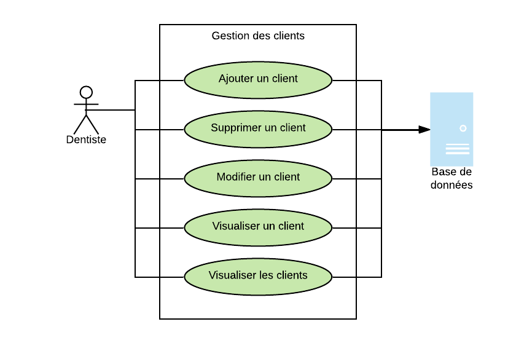

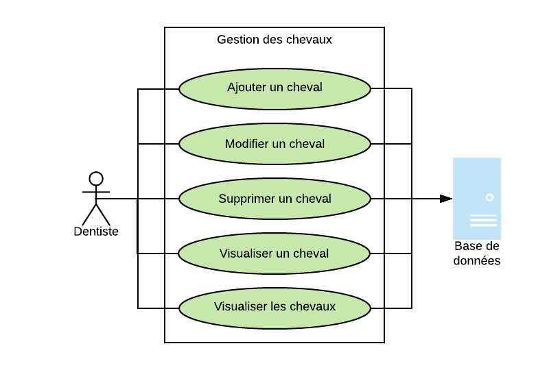

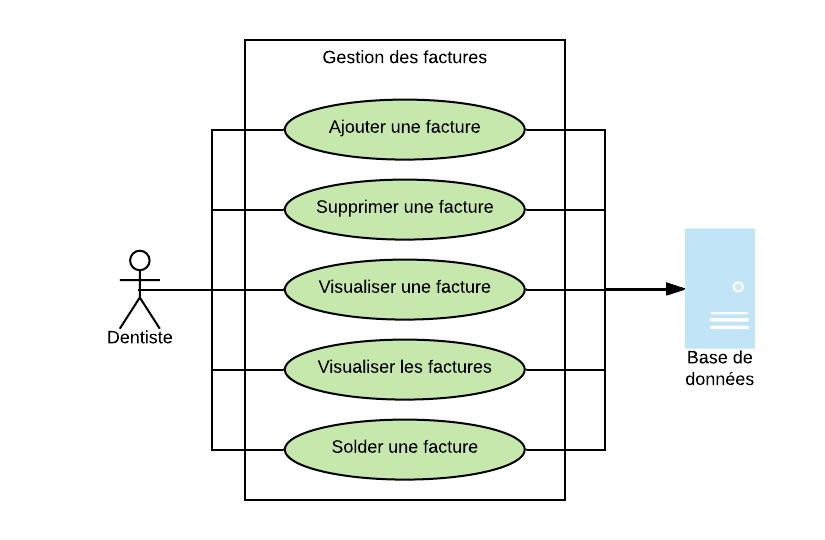

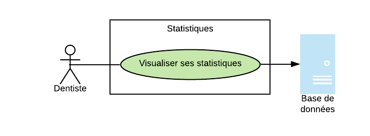

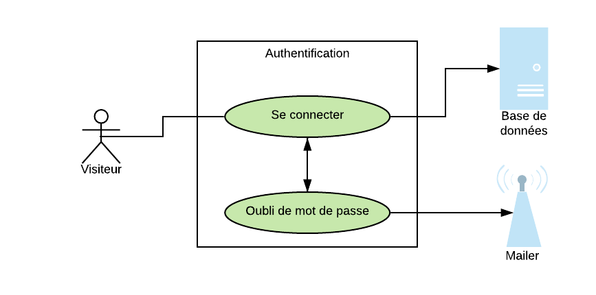

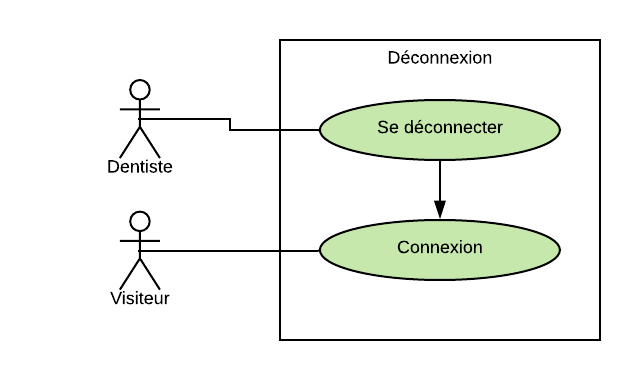

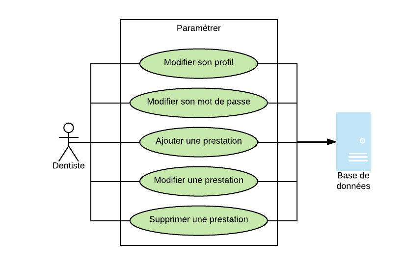

## Contraintes techniques
---------

* Mobilité : Application devant être disponible sur deskop, tablette tactile ou mobile.
* Centralisation des données : Base de données sur serveur distant.
* Inégalité des accès au réseau : Prévoir base de données locale tampon.
* Interfaces didactiques et simples.
* Sécurité des informations.
* Intégrité des données, notamment pour la facturation.

## Modélisation de la base de données 
--------
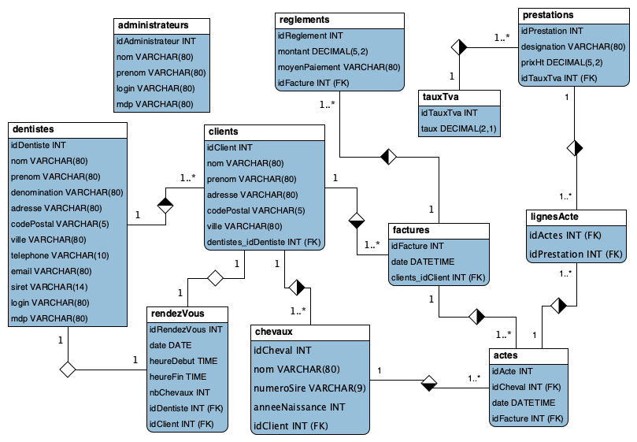

## Technologies utilisées
------------
Plusieurs paramètres permettent de nous orienter sur l'architecture et les technologies associées à utliser pour ce projet.

### Back-end

Les contraintes de mobilité et de centralisation des données nous orientent vers la réalisation d'une API asociée à une base de données relationnelle.

Plusieurs languages et leur framework associé nous permettent cet usage :
* PHP et son framework Symfony
* Java et Spring
* Ruby et Ruby on Rails
* Javascript et NodeJS
* Python et Django
* ect

Plusieurs critères me permettent de selectionner le language et le framework utilisé :

* Communauté
* Documentation
* Marché de l'emploi
* Appétence personnelle

Mon choix se portera donc sur PHP et son framework Symfony :

Nous aurons donc la possibilité de centraliser l'ensemble de notre logique métier et de nos données qui seront accessible depuis n'importe quelle  interface.

Une documentation d'API avec l'ensemble des endpoints mis à disposition sera réalisée.

La réalisation d'un base de données relationnelle avec MySQL permettera de s'assurer de l'intégrité des données.

### Front-end

D'un point de vue front-end, plusieurs technologies nous permettent de satisfaire notre besoin multiplateforme.

L'étude et la pratique du framework Javascript Angular pendant ma formation Concepteur développeur à l'ENI m'encourage à me diriger vers celui-ci pour ce projet.

